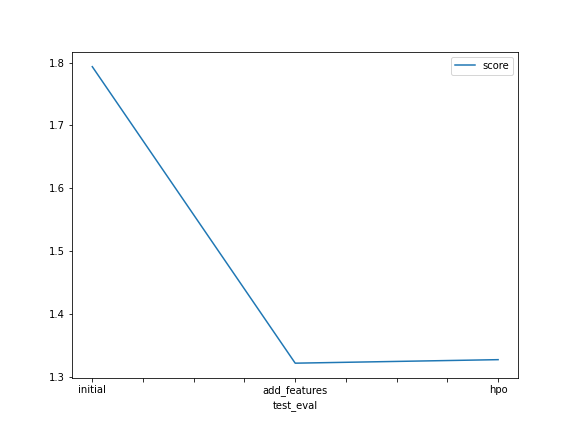

# Report: Predict Bike Sharing Demand with AutoGluon Solution
#### Sarthak Gupta

## Initial Training
### What did you realize when you tried to submit your predictions? What changes were needed to the output of the predictor to submit your results?
Intitially when I tried submitting the predictions I realised that the negative outputs were not allowed. Thus I changed all the negative outputs to 0 so I could be accepted by Kaggle.

### What was the top ranked model that performed?
WeightedEnsemble_L2 was the top ranked model every time.

## Exploratory data analysis and feature creation
### What did the exploratory analysis find and how did you add additional features?
Exploratory analysis found the patterns in the dataset, as it plotted the histogram for the relation between output and the input label.
Additional Features were found in date time as we could see there was no major distinction between the datetime.

### How much better did your model perform after adding additional features and why do you think that is?
It performed much worse afterwards because I thought that year didnt play any role in the model and it wass not needed but later I found it provided for major role in the distinction.

## Hyper parameter tuning
### How much better did your model preform after trying different hyper parameters?
It performed much worse than other models. 

### If you were given more time with this dataset, where do you think you would spend more time?
If I was given more time, I would I have spent more time in EDA to understand the dataset and its's correlations and explore more hyperparameters that might have helped in increasing the accuracy of the model.

### Create a table with the models you ran, the hyperparameters modified, and the kaggle score.
|model|num_trials|searcher|scheduler|score|
|--|--|--|--|--|
|initial|1024|None|None|1.79990|
|add_features|1024|None|None|0.53809|
|hpo|32|auto|local|0.53141|

### Create a line plot showing the top model score for the three (or more) training runs during the project.

TODO: Replace the image below with your own.

### Create a line plot showing the top kaggle score for the three (or more) prediction submissions during the project.

TODO: Replace the image below with your own.

## Summary
Original model was the most accurate one as it didnt change the parameters and thus performed much better. 
The additional parameter required more time dedicated towards eda.
HPO was not helping the model as I wanted because the increased retriction made it difficult for the model to work with the time limit of 10 minutes.
 